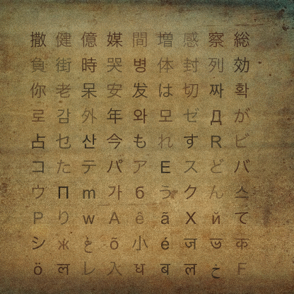

# Arche Writing Dataset Generator

Sketch to automate the generation of labeled dataset of character 8bit system.

## Sample Images



## Sample annotations

```
162 0.21995193 0.22716346 0.098557696 0.098557696
163 0.36658654 0.22716346 0.098557696 0.098557696
164 0.51322114 0.22716346 0.098557696 0.098557696
165 0.6598558 0.22716346 0.098557696 0.098557696
166 0.21995193 0.37379807 0.098557696 0.098557696
167 0.36658654 0.37379807 0.098557696 0.098557696
168 0.51322114 0.37379807 0.098557696 0.098557696
169 0.6598558 0.37379807 0.098557696 0.098557696
170 0.21995193 0.5204327 0.098557696 0.098557696
171 0.36658654 0.5204327 0.098557696 0.098557696
172 0.51322114 0.5204327 0.098557696 0.098557696
173 0.6598558 0.5204327 0.098557696 0.098557696
174 0.21995193 0.6670673 0.098557696 0.098557696
175 0.36658654 0.6670673 0.098557696 0.098557696
176 0.51322114 0.6670673 0.098557696 0.098557696
177 0.6598558 0.6670673 0.098557696 0.098557696
178 0.21995193 0.8137019 0.098557696 0.098557696
179 0.36658654 0.8137019 0.098557696 0.098557696
180 0.51322114 0.8137019 0.098557696 0.098557696
181 0.6598558 0.8137019 0.098557696 0.098557696
```

## Sample labelmap

```
撒
健
億
媒
間
増
感
察
総
負
街
時
哭
병
体
封
列
効
你
老
呆
安
发
は
切
짜
확
로
감
外
年
와
모
ゼ
Д
が
占
乜
산
今
も
れ
す
R
ビ
コ
た
テ
パ
ア
E
ス
ど
バ
ウ
П
m
가
б
う
ク
ん
스
Р
り
w
А
ê
ã
Х
й
て
シ
ж
غ
õ
小
é
ज
ভ
क
ö
ল
レ
入
ध
ब
ल
خ
F
স
e
व
ম
و
য
и
थ
श
k
ح
く
ú
o
न
ব
ए
দ
Y
ン
द
n
u
ন
م
ッ
ь
ノ
к
ت
ب
ه
t
т
一
ا
د
і
ا
г
ر
ز
र
j
v
ة
з
ن
L
x
っ
z
э
T
प
н
л
ç
ş
č
त
ل
イ
य
し
я
ト
ü
ष
খ
থ
h
ц
ह
ی
র
こ
ñ
ó
হ
リ
अ
ع
स
म
ペ
ي
フ
d
ォ
ド
р
ご
ы
С
い
گ
д
と
ナ
Z
ক
ই
м
三
ョ
나
g
ш
マ
で
시
S
ق
に
口
س
介
И
ظ
뉴
そ
キ
や
ズ
В
자
ص
兮
ض
코
격
ダ
る
な
ф
리
Ю
め
き
宅
お
世
吃
ま
来
店
呼
설
진
음
염
론
波
密
怪
殺
第
断
態
閉
粛
遇
罩
孽
關
警
```